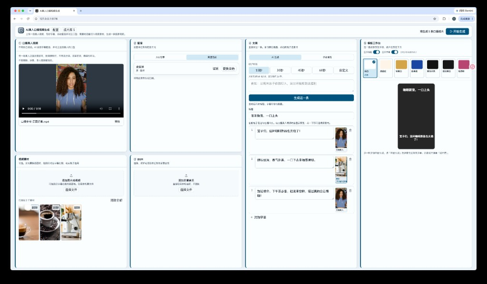
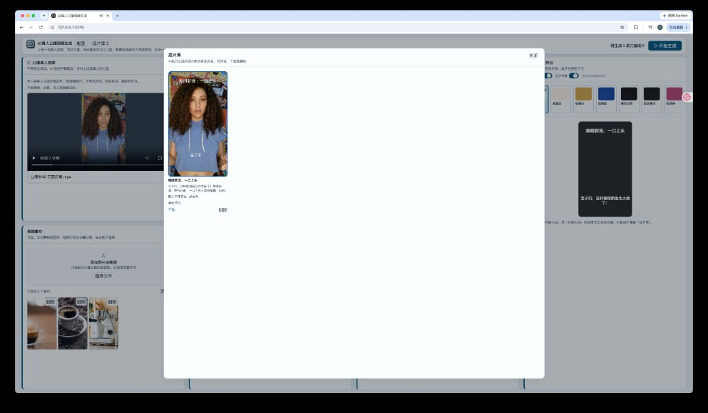

# AI真人口播视频生成

想做一条真人口播，又不必自己对着镜头念稿。

把一段真人出镜的视频放进来（脸清楚就行，不用说话），写好要说的话，选一套字幕样子。本机先找火山引擎或阿里百炼配音，再把这段真人和配音交给百炼 VideoRetalk 对上口型，最后用 FFmpeg 合成一条竖屏 MP4。中间某几句想换画面，可以把视频素材整屏切进去。

密钥只留在你的浏览器里；任务和成片写在本机 `data/`。没有云端服务器，也不会替你去调任何接口。这也不是抖音、字节跳动、火山引擎、阿里云或 DeepSeek 的官方产品。

由 [yizhi-chengzi](https://github.com/yizhi-chengzi) 开源。仓库：[github.com/yizhi-chengzi/video-ai-talking](https://github.com/yizhi-chengzi/video-ai-talking)

## 界面

工作台：左侧口播真人视频和视频素材，中间配音、BGM 和文案，右侧选皮肤并预览。



生成完成后，历史成片在「成片库」里预览、下载或删除。



截图里的出镜和画面来自免费可商用素材库（如 [Pexels](https://www.pexels.com/license/)），只用来演示界面，**不是本工具的真实用户**，也不代表出镜人代言本项目。仓库自带的口播试用片及来源见 [demos/README.md](./demos/README.md)，截图说明见 [docs/screenshots/README.md](./docs/screenshots/README.md)。

## 你需要准备什么

1. [Node.js](https://nodejs.org/) 20 或更高
2. 本机已安装 [FFmpeg](https://ffmpeg.org/) 和 ffprobe，并且能在终端里直接运行 `ffmpeg`、`ffprobe`
3. 下面这些密钥。打开页面里的「配置」也能看到同样的申请入口。

### 要申请什么 Key、去哪里申请

| 用途 | 申请什么 | 去哪里申请 | 是否必填 |
| --- | --- | --- | --- |
| 对口型 | 阿里百炼 **VideoRetalk** 的 API Key（华北2 / 北京地域，以 `sk-` 开头） | [产品介绍](https://help.aliyun.com/zh/model-studio/videoretalk/) · [密钥管理](https://bailian.console.aliyun.com/?tab=model#/api-key) | 出片必填，填到「AI口播对口型配置」 |
| 配音（百炼） | 阿里百炼 **CosyVoice** 的 API Key（以 `sk-` 开头） | [产品介绍](https://help.aliyun.com/zh/model-studio/tts-model/) · [密钥管理](https://bailian.console.aliyun.com/?tab=model#/api-key) | 配音两家选一家即可。填到「AI配音配置」 |
| 配音（火山） | 火山引擎语音合成的 **App ID** 和 **Access Token** | [产品介绍](https://www.volcengine.com/product/tts) · [控制台申请](https://console.volcengine.com/speech/service/8) | 配音两家选一家即可。填到「AI配音配置」 |
| 文案 | DeepSeek **API Key**（以 `sk-` 开头） | [开放平台](https://platform.deepseek.com/) · [创建 API Key](https://platform.deepseek.com/api_keys) | 可选。不填也可以手写口播文案 |

百炼的配音 Key 和对口型 Key 分开填：可以用同一把，也可以用另一把。出片时在配音区选择用火山还是百炼。

本机还需要能访问你实际用到的接口：

- 阿里百炼：`https://dashscope.aliyuncs.com`（配音、临时上传、VideoRetalk）
- 火山 TTS：`https://openspeech.bytedance.com`
- DeepSeek：`https://api.deepseek.com`

Linux 上若要用系统文件选择器，请先安装 [Zenity](https://gitlab.gnome.org/GNOME/zenity)（常见桌面环境一般已有）。没有的话，可以把文件从文件管理器拖进页面。

## 启动

```bash
git clone https://github.com/yizhi-chengzi/video-ai-talking.git
cd video-ai-talking
cp .env.example .env
npm install
npm run dev
```

浏览器打开 [http://127.0.0.1:5175](http://127.0.0.1:5175)。这是日常开发 / 本机使用的方式。

已经构建过、只想起一个本机服务时：

```bash
npm run build
npm start
```

然后打开 [http://127.0.0.1:8789](http://127.0.0.1:8789)。页面和 API 都由这个地址提供。没先 `build` 的话，打开页面会是 404。

`.env` 只放端口，不要把 API Key 或 TTS Token 写进去。本地验证可以设 `VAT_MOCK=1`，配音 / 上传 / 对口型 / FFmpeg / DeepSeek 全部走 mock，不访问外网。

## 怎么用

1. 打开「配置」：在「AI口播对口型配置」填写百炼 VideoRetalk Key；要用百炼或火山配音、AI 写文案时再填对应凭证。每个卡片上有产品介绍和申请入口，点「测试」确认连通。
2. 在 ①「口播真人视频」添加一段真人正面近景：脸清楚即可，不用念台词；不要侧脸、远景、多人或脸被挡住。没有现成片子时，可用仓库里的 [demos/talking-head-cn.mp4](./demos/talking-head-cn.mp4)。视频素材在独立面板里添加，某句要换画面时拖到④对应字幕右侧。工具引用本机原路径，不把文件复制进项目。可选在 ③ 添加一首 BGM。
3. 在 ② 选择火山或百炼，再选音色。密钥在「配置」里填，这里只选音色。
4. 在 ④ 选「AI 生成」或「手动填写」其中一种。AI 生成可先选成片时长（15 / 30 / 45 / 60 秒，也可自定义 10–60 秒），再填主题。某句要切画面时，点该句右侧画面格选素材，或把视频素材拖过去。
5. 在 ⑤ 选一套皮肤。可用「显示标题 / 显示字幕」控制成片是否画出标题和字幕；关掉前会确认。口播仍按字幕生成。
6. 点「开始生成」。一次只出 1 条成片，同时只能跑一个任务。链路是配音 → 对口型 → 成片。
7. 在工作台看进度，预览或下载 MP4。点「重新生成」时，如果参考视频、口播正文和音色没变，会跳过对口型只重跑 FFmpeg。历史成片在「成片库」。

## 本机数据

| 位置 | 内容 |
| --- | --- |
| 浏览器 `localStorage` 的 `vat.config` | 你填的 Key 和 TTS 凭证 |
| 项目下的 `data/` | 任务 JSON、配音音频、对口型中间片、成片 MP4；引用素材只记路径 |

任务 JSON 里不会保存 API Key 或 TTS Token。

关掉页面或停掉本机服务后，正在跑的任务会停。下次打开不会自动续跑。

出片时，参考视频和配音会被上传到阿里百炼官方临时存储（`oss://`，约 48 小时），供 VideoRetalk 使用。详见 [docs/privacy.md](./docs/privacy.md)。

## 常见问题

**提示找不到 ffmpeg**  
先在终端执行 `ffmpeg -version` 和 `ffprobe -version`。macOS 可用 `brew install ffmpeg`。

**对口型失败**  
确认已在「AI口播对口型配置」填写百炼 VideoRetalk API Key，本机可访问 `dashscope.aliyuncs.com`，参考视频是带人脸的近景片段。

**TTS 测试失败**  
核对当前选用的那一家凭证，以及本机能否访问对应域名。火山要核对 App ID 与 Access Token 是否来自同一语音合成应用。

**画面没有中文标题**  
FFmpeg 需要本机有可用中文字体。工具会按常见路径查找；找不到时成片仍会生成，但标题 / 字幕可能是方框。说明见 [templates/fonts.md](./templates/fonts.md)。

**Linux 点「选择文件」没反应**  
确认已安装 `zenity`，或改用拖入文件。

## 开发

```bash
npm test
npm run typecheck
```

测试默认不调用真实 DeepSeek / 火山 / 百炼接口，也不跑完整 VideoRetalk，不要求本机已安装 FFmpeg。

不要从本目录 import 其他产品源码，也不要把本机 `data/`、密钥或人脸素材提交上去。

## 免责、安全与行为

使用前请阅读 [DISCLAIMER.md](./DISCLAIMER.md)、[SECURITY.md](./SECURITY.md)、[docs/privacy.md](./docs/privacy.md)。贡献见 [CONTRIBUTING.md](./CONTRIBUTING.md)。参与时请遵守 [CODE_OF_CONDUCT.md](./CODE_OF_CONDUCT.md)。

## License

[MIT](./LICENSE)
